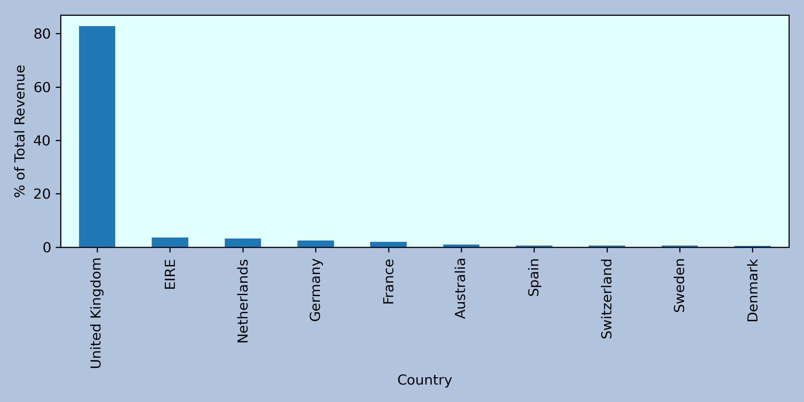
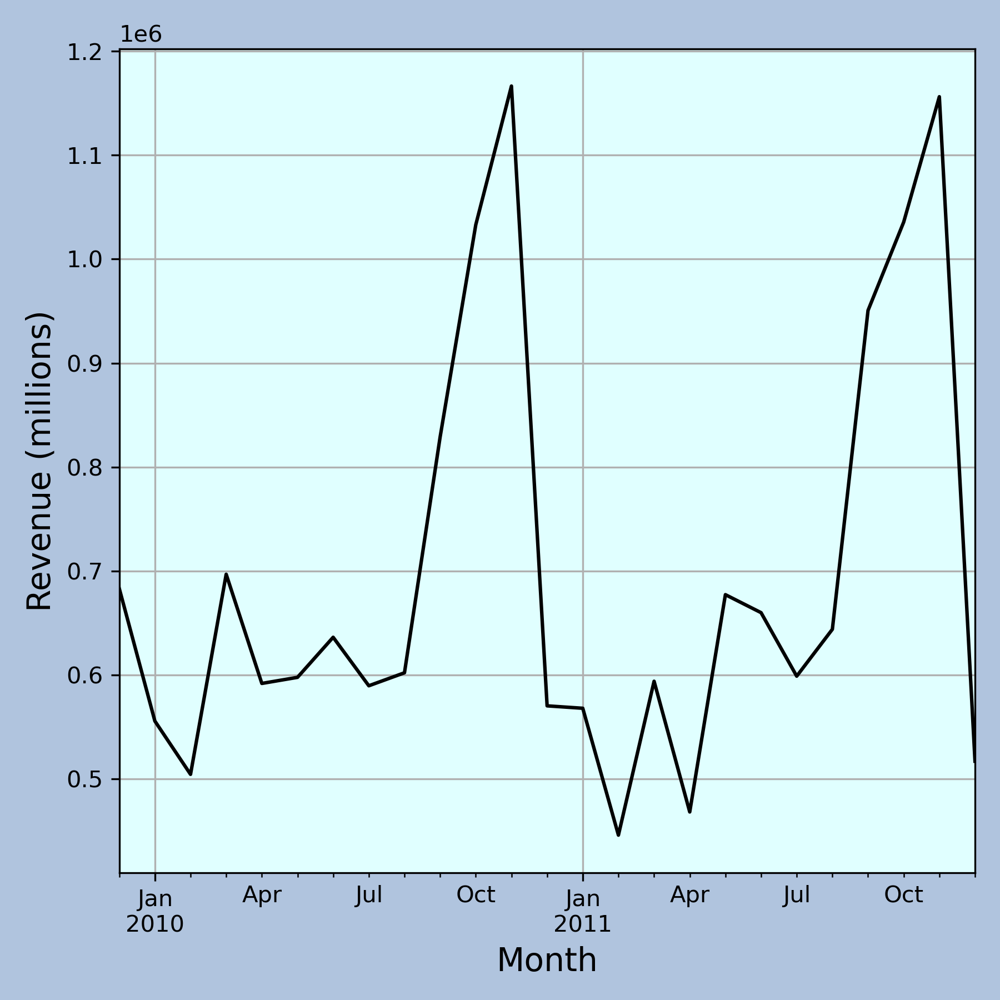
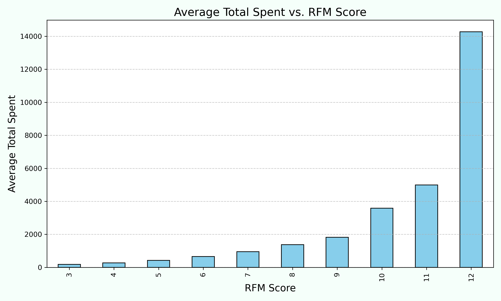
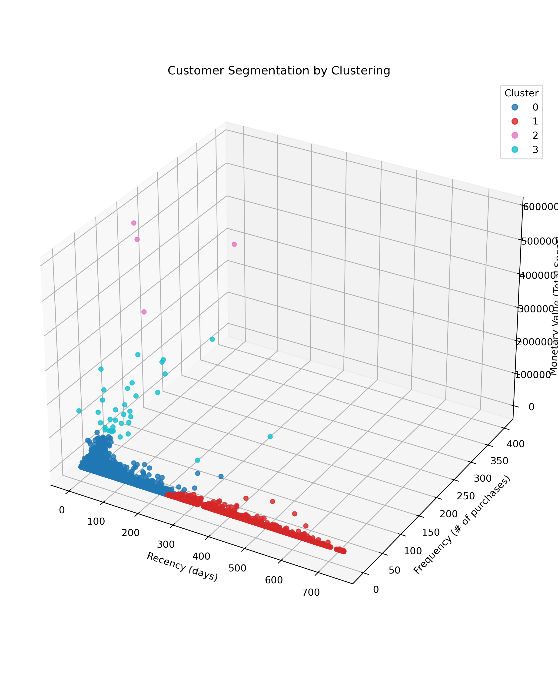
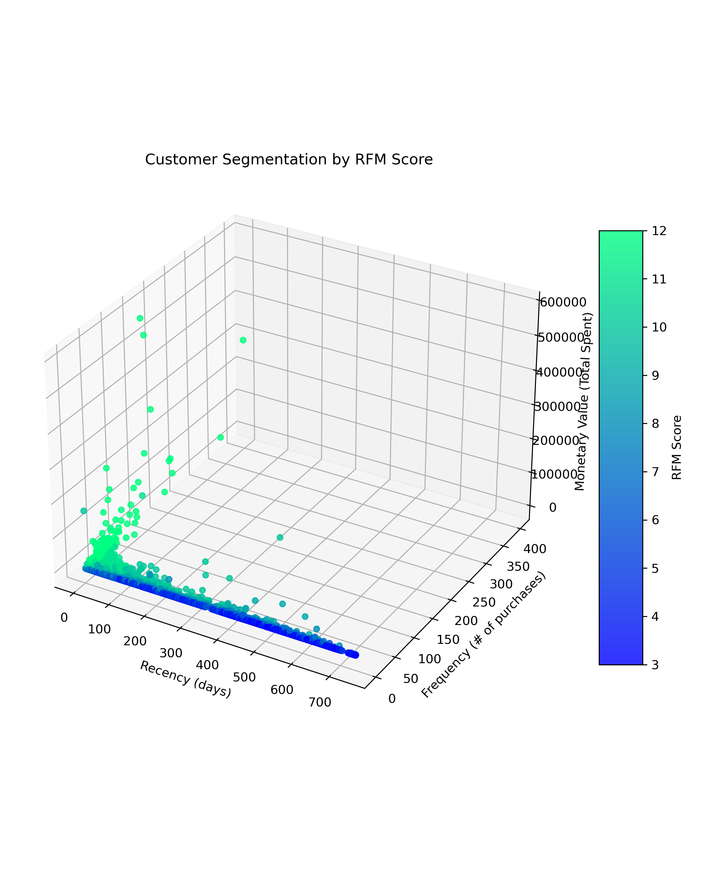

# E-commerce Customer Analysis: Understanding Behavior and Identifying High-Value Segments

This project analyzes customer purchasing behavior in the [Online Retail II Dataset](https://www.kaggle.com/datasets/mashlyn/online-retail-ii-uci). 

(Note: to run the code in the included jupyter notebook, you will have to download the data and include it in the same folder)

## Objectives

## Skills Demonstrated

## Key Results

## Included Visualizations

## Insights and Recommendations

## Conclusion

This project demonstrates how EDA, segmentation and clustering can be applied to real-world retail data to create actionable insights. These approaches highlight customer behaviors, identifies high-value customers, and suggests strategies for retention and revenue growth.

