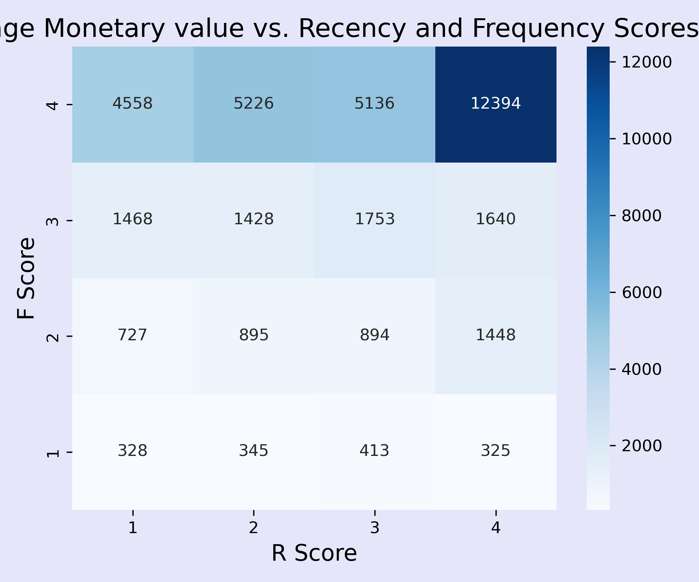

# E-commerce Customer Analysis: Understanding Behavior and Identifying High-Value Segments

This project analyzes customer purchasing behavior in the [Online Retail II Dataset](https://www.kaggle.com/datasets/mashlyn/online-retail-ii-uci). 

(Note: to run the code in the included jupyter notebook, you will have to download the data and include it in the same folder)

## Objectives

- Explore sales trends: top products, countries, and monthly revenue
- profile customer behavior
- segment customers using RFM (Recency, Frequency, Monetary Value) analysis
- Apply KMeans clustering for unsupervised customer segmentation
- Reveal actionable insights for customer retention and revenue growth

## Skills Demonstrated

- data cleaning and preprocessing
- exploratory data analysis
- customer segmentation with RFM analysis
- Clustering with Kmeans (unsupervised machine learning)
- data-driven business recommendations

## Key Results

- UK customers account for about 85% of total revenue
- Monthly revenue spikes between September and November, likely due to holiday shopping
- Higher frequency and purchase recency correlates with higher total spending
- Segmentation via Kmeans clustering and RFM analysis revealed distinct customer groups

## Included Visualizations

**Revenue of High-Value Countries:**

**Revenue Per Month:**

**RFM (Recency, Frequency, Monetary Value) Analysis Heatmap:**

**Total Spent vs. RFM score:**

**Scatterplot of categories revealed by KMeans Clustering:**

**Scatterplot of RFM Scores for Comparison with KMeans Clusters**

## Insights and Recommendations

- focused marketing efforts on recent low-value customers to increase retention
- nurture high and ultra-high revenue groups with loyalty programs
- increase inventory and marketing campaigns during months with a yearly spike in purchases (the holiday season, September-November)
- use attributes of high-value customers to inform lookalike marketing campaigns to increase total revenue

## Conclusion

This project demonstrates how EDA, segmentation and clustering can be applied to real-world retail data to create actionable insights. These approaches highlight customer behaviors, identifies high-value customers, and suggests strategies for retention and revenue growth.

